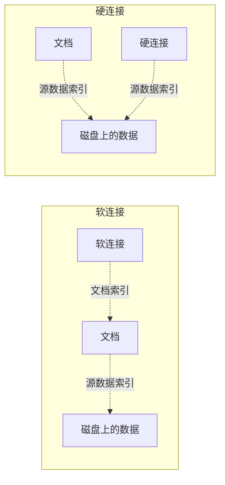

# 碎片化的RHEL8知识3

## `hostnamectl`主机名配置

**长主机名：**`localhost.localdomain`

**短主机名：**`localhost`

**查询长主机名命令：**`hostname`

### 修改主机名

使用 `hostname`命令也可以临时修改主机名，如果需要长期修改，则需要使用 `hostnamectl`命令，它的意思是 `Control the system hostname`(控制系统主机名)

```bash
hostnamectl set-hostname server0.example.com
# 将主机名修改为 server0.example.com
```

修改后的主机名会在终端重启后生效

当然，也可以直接修改主机名的配置文件 `/etc/hostname`

```bash
vim /etc/hostname
# 注意:某些系统如果没有修改过主机名是没有这个文件的
```

## `nmcli`IP地址等网络配置

**一共有三种方法可以修改：**

1. 修改配置文件
2. 命令修改
3. 伪图形界面修改

### 1#修改配置命令

查看 `/etc/sysconfig/network-scripts/`目录就可以知道本机有几张网卡，多个网卡会有多个配置文件

```bash
# 查看网卡数量
[root@server0 ~]# ll /etc/sysconfig/network-scripts/
total 4
-rw-r--r--. 1 root root 281 Nov 25 23:28 ifcfg-ens160
# 查看网卡内的配置，加了说明的是比较重要的
[root@server0 ~]# cat /etc/sysconfig/network-scripts/ifcfg-ens160 
TYPE=Ethernet							#类型为：以太网
PROXY_METHOD=none
BROWSER_ONLY=no
BOOTPROTO=dhcp							#IP地址获取方式：DHCP
DEFROUTE=yes
IPV4_FAILURE_FATAL=no
IPV6INIT=yes
IPV6_AUTOCONF=yes
IPV6_DEFROUTE=yes
IPV6_FAILURE_FATAL=no
IPV6_ADDR_GEN_MODE=stable-privacy
NAME=ens160								#网卡名称：ens160
UUID=5d07d616-b002-4ab6-9283-0eef8698bd96
DEVICE=ens160							#设备名称：ens160
ONBOOT=no								#是否开机自动联网：否
```

如果要实现最基本的上网功能，这张网卡起码需要以下几项配置

```bash
TYPE=Ethernet							#类型为：以太网
BOOTPROTO=none							#IP地址获取方式：静态
NAME=ens160								#网卡名称：ens160
DEVICE=ens160							#设备名称：ens160
ONBOOT=yes								#是否开机自动联网：是
IPADDR=172.25.0.11						#IP地址
PREFIX=24								#子网掩码：24
GATEWAY=172.25.0.254					#网关地址
DNS1=172.25.254.254						#DNS地址
```

最后使用命令激活网卡配置

```bash
[root@server0 ~]# nmcli connection up ens160
```

### 2#使用命令进行配置

设置网卡的配置需要使用 `nmcli`命令，它的全称是 `NetworkManager command-line`(网络管理器命令行)，在 man文档中的描述是`command-line tool for controlling NetworkManager`(用于控制网络管理器的命令行工具)

首先我们先查看网卡的数量和情况

```bash
[root@server0 ~]# nmcli connection show
#网卡名  通用唯一识别码                          连接类型    设备类型
NAME    UUID                                  TYPE      DEVICE 
virbr0  19f097a0-b047-47d3-9052-5ac06e0f3825  bridge    virbr0 
ens160  5d07d616-b002-4ab6-9283-0eef8698bd96  ethernet  -- 
# 可以看到我们有两张网卡的一些信息，上面的 virbr是VM创建的虚拟桥接网卡，实际网卡只有一张 ens160
```

接下来就是使用 网卡的名称进行网络配置了

```bash
# 这里使用了 \进行分隔，但是不推荐使用，因为这会使 bash的自动补全失效，这里仅用用于说明
#     连接        修改   网卡名(推荐加引号)
nmcli connection modify 'ens160' \
#ipv4.方法   手动
ipv4.method manual \
#ipv4.本机地址   地址/子网掩码
ipv4.addresses 172.25.0.11/24 \
#ipv4.网关地址 网关地址
ipv4.gateway 172.25.0.254 \
#ipv4.DNS地址 dns地址
ipv4.dns 172.25.254.254 \
#连接.自动连接           是
connection.autoconnect yes
```

但是这时候并没有完成配置，使用 `ifconfig`命令可以查看当前网络配置，会发现刚刚的设置并没有生效。

这是因为配置完成以后也是需要激活网卡配置的，因此一次修改网卡的配置的完整命令如下:

```bash
[root@server0 ~]# nmcli connection modify 'ens160' ipv4.method manual ipv4.addresses 172.25.0.11/24 ipv4.gateway 172.25.0.254 ipv4.dns 172.25.254.254 connection.autoconnect yes
[root@server0 ~]# nmcli connection up ens160
```

**最后别忘记检查配置是否生效**

- `ifconfig`命令可以查看网卡的IP地址
-  `route -n`命令可以查看到网卡的网关
- `cat /etc/resolv.conf`文件可以查看到DNS地址

### 3#伪图形界面修改

输入命令 `nmtui`即可开启伪图形管理界面，它的全称是 `NetworkManager Text User Interface`(网络管理器文本图形界面)，在 man文档中的描述是  `Text User Interface for controlling NetworkManager`(用于控制网络管理器的文本用户界面)

随后我们就能看到 `NetworkManager `的界面了


接下来选中 `Edit a connection`进行配置


选中其中一张网卡，就可以看到相关的信息了，移动光标到 `Show`可以展开网卡的相关信息了


移动光标至 `Addresses`设置IP地址，网关和DNS也可以用同样的方法写入


移动光标到 `Automatically connect`,使用空格键可以勾选这个选项


配置完成后，将光标移动至右下角的OK并回车确认，即可保存设置并退出网卡配置界面

后面的操作也非常类似，返回并退出就行了


退出 `nmtui`后，需要使用命令激活网卡的配置

```bash
[root@server0 ~]# nmcli connection up ens160
```

## 修改语言

### 临时修改终端的语言

旧版本下可以使用 `export`命令临时修改终端的语言

```bash
# 修改成中文
export LANG=zh_CN.UTF-8
# 修改成英文
export LANG=en_US.UTF-8
```

### 永久修改语言

语言的配置文件路径是 `/etc/locale.conf`，使用 vim进行修改即可

```bash
# 原始配置
LANG="en_US.UTF-8"
# 将其修改成以下这个即可
LANG="zh_CN.UTF-8"
```

## `tar`文件的解压缩

`tar`命令意为 `tape archive`(磁带存档)，在 man手册中的解释是 `an archiving utility`(归档实用程序)，它是用来建立、还原备份文件的工具程序，它可以加入、解开备份文件内的文件

归档文件有多种格式，常见的是以下三种

- `.gz`：gzip，全称 `GNU zip` (速度快、压缩比例小)
- `.bz2`：bzip2
- `.xz`：unxz(速度慢、压缩比例大)

### 制作 tar

**语法：**`tar -[格式][其他]cf /路径/压缩包名称.tar.格式 /路径/源文档`

*若无路径则直接将包存放于当前路径*

参数说明：

- 必要选项：
  - `-c`：`create`(创建)创建 tar包必须要有
  - `-f`：`file`(文件)用于指定压缩文档，必须放在最后面
- 格式选项：
  - `-z`：压缩成 `.gz`文件
  - `-j`：压缩成 `.bz2`文件
  - `-J`：压缩成 `.xz`文件
- 其他选项：
  - `-v`：可视化压缩，显示压缩过程
  - -`P`：压缩保留源文档的绝对路径，释放时也可以使用该选项释放到源路径中

### 查看 tar

**语法：**`tar -tf /压缩包存放路径/压缩包名称.tar.格式 `

参数说明：

- 必要选项：
  - `-t`：`list`(列出)用于查看 tar包
  - `-f`：`file`(文件)用于指定压缩文档，必须放在最后面

### 释放 tar

**语法：**`tar -[其他]xf /压缩包存放路径/压缩包名称.tar.格式 [-C /释放路径] `

参数说明：

- 必要选项：
  - `-x`：`extract`(提取)用于从备份文件中还原文件
  - `-f`：`file`(文件)用于指定压缩文档，必须放在最后面
- 可选选项：
  - `-C`：`directory`(目录)用于指定释放目录
- 其他选项：
  - `-v`：可视化压缩，显示解压过程
  - `-P`：释放到压缩时保留的绝对路径中
  - 如果没有 `-C`和 `-P`选项，则会释放到当前压缩包所处目录下

```bash
# 把 /etc/目录压缩并命名为 etc_archive.tar.gz 格式为gz,保留绝对路径，可视化压缩
[root@server0 ~]# tar -zPvcf etc_archive.tar.gz /etc/
# 查看 etc_archive.tar.gz文件
[root@server0 ~]# tar -tf etc_archive.tar.gz
# 解压 etc_archive.tar.gz到源目录中(按绝对路径解压),可视化解压
root@server0 ~]# tar -Pvxf etc_archive.tar.gz
```

## `ssh`远程管理

`ssh`命令意为 `Secure Shell`(安全外壳)，在 man手册中的解释是 `OpenSSH SSH client (remote login program)`(打开用于远程登录的ssh客户端)，它是用来远程登录其他计算机的

**命令：**`ssh [选项] [用户名]@[远程主机的IP或域名]`

*如果不填写用户名，则使用当前用户名进行远程登录*

**常用选项：**

- `-X` 远程登录主机时可以调用远程主机提供的图形模块(仅部分程序支持)
- `-p` 远程登录时指定的端口号(默认:22)

## `scp`远程传输

`scp`命令意为 `secure copy`(安全拷贝)，在man手册中的解释是 `remote file copy program`(远程文件复制程序)，相当于 `ssh + cp` 

**命令格式：**

1. 从本地传输到远程：`scp [-r] /本地源文档路径 用户名@IP地址:/远程存放路径`
2. 从本地传输到远程：`scp [-r] 用户名@IP地址:/远程源文档路径 /本地存放路径`

*`-r`表示递归复制，复制目录的时候使用*

## NTP时间同步

**NTP时间同步协议：**`Network Time Protocol`(网络时间协议)

- NTP服务器为客户机提供标准时间
- NTP客户机需要与NTP服务器保持沟通

**补充：**Linux配置服务思路 `装包->配置->起动服务`

### 1#检查软件包

使用 `rpm`命令进行查询，英文全拼`redhat package manager`(红帽包管理器)原本是 Red Hat Linux 发行版专门用来管理 Linux 各项套件的程序，由于它遵循 GPL 规则且功能强大方便，因而广受欢迎。逐渐受到其他发行版的采用。

查询命令为：

```bash
[root@server0 ~]# rpm -q chrony
chrony-3.3-3.el8.x86_64
# 只要有结果就行
```

### 2#修改配置文件

使用 vim修改 `/etc/chrony.conf`文件

找到并修改下面这行

```bash
pool 2.rhel.pool.ntp.org iburst
# 中间的 2.rhel.pool.ntp.org为ntp服务器的url
# 修改为给定的ntp服务器url即可，比如
pool classroom.example.com iburst
```

### 3#重启服务

```bash
# 重启服务
[root@server0 ~]# systemctl restart chronyd
# 开机自启
[root@server0 ~]# systemctl enable chronyd
```

### 4#检查

```bash
# 只要输出结果最下方里包含有'^*'以及对应的域名即可
# ^表示服务器，*表示已同步
[root@server0 ~]# chronyc sources -v
```

## `tuned`性能调优

`tuned`命令意为调整，在man手册中的描述是 `dynamic adaptive system tuning daemon`(动态自适应系统调整保护程序)

### 1#检查软件包

```bash
[root@server0 ~]# rpm -q tuned 
tuned-2.10.0-15.el8.noarch
# 只要输出了上面的结果即可
```

### 2#检查服务是否启动

```bash
[root@server0 ~]# systemctl is-active tuned
active
# 询问服务是否"活跃"
# 使用下面的命令也可以查询到运行状态
[root@server0 ~]# systemctl status tuned
```

### 3#查看`tuned`配置模式

`tuned-adm`命令在man手册中的描述是 `command line tool for switching between different tuning profiles`(用于在不同调整配置文件之间切换的命令行工具)，可以用它来进行查询和配置。

```bash
[root@server0 ~]# tuned-adm list
```

上面的命令会输出调优支持的模式，翻译以后的结果如下


### 4#查看`tuned`建议模式

```bash
[root@server0 ~]# tuned-adm recommend 
virtual-guest
```

### 5#查看当前配置模式

```bash
[root@server0 ~]# tuned-adm active 
Current active profile: virtual-guest
```

### 6#切换配置模式

**语法：**`tuned-adm profile [模式名称]`

```bash
# 切换成在虚拟机上运行的模式
[root@server0 ~]# tuned-adm profile virtual-guest
```

### 7#关闭调优

```bash
[root@server0 ~]# tuned-adm off
```

### 使用RHEL8新功能调优

`cockpit`意为"座舱"，是一个基于 Web的服务器管理工具，启动后，可以在浏览器中查看服务器并使用鼠标执行系统任务,很容易管理存储、配置网络和检查日志等操作。在新版的 RHEL8和 CentOS8中是默认安装的。

#### 1#启动服务

```bash
# 使用远程连接登录后就可以看到相关的命令提示
[root@server0 ~]# systemctl enable --now cockpit.socket
```

#### 2#检查端口

这个服务的 Web访问端口是9090端口，可以使用 `ss`命令进行查看，该命令意为 `Socket Statistics`(socket统计)。`ss`命令显示的内容与 `netstat`类似，但 `ss`命令能够显示更详细的有关TCP和连接状态的信息，而且比 `netstat`更快更高效

```bash
[root@server0 ~]# ss -nultp|grep :9090
```

#### 3#浏览器访问

在浏览器输入 IP地址或是域名，再加上端口号 `:9090`即可进行访问

## 周期性计划任务

`crontab`命令主要用于编写定期定时执行的脚本命令。由于 `cron`源自希腊语 χρόνος(转写:chronos)，原意为时间，因此 `crontab`就是任务时间表的意思。

### 编辑任务时间表

**语法：**`crontab -e -u [用户名]`

**时间格式：**

```bash
#分 时   日  月  星期	命令路径(绝对路径)
*	*	*	*	*	command
```

*注意：不要填写了超出时间范围的数字*

由于 `crontab`使用的是命令的绝对路径，可以使用 `which`命令查询命令的路径

**语法：**`which [命令名]`

**符号说明：**

- `*`	匹配范围内任意时间
- `,`	分割多个不连续的时间点
- `-`	指定连续时间范围
- `/n`	代表频率

```bash
# 打开用户 student0的任务时间表
[root@server0 ~]# crontab -e -u student0
# 写入下面这行命令
40 10 7 12 * /usr/bin/ls --color=auto
#在12月7日的10:40分执行 ls命令
```

### 查看任务时间表

**语法：**`crontab -l -u [用户名]`

## 软链接与硬链接

**相关概念：**

- i节点：index(索引号)，即源文件在存储上存放的地址

两者的对比如下



### 软链接

**寻址流程**

链接-> 数据区域-> 源文件的index-> 源文件-> 源文件的index-> 数据区域:文档数据

**语法：**`ln -s /路径/源文档 /路径/连接名`

**特点：**

- 源文档被删除，链接失效
- 修改软链接，源文档同步更新，反之，修改源文件，软连接也同步更新
- 软连接可存放在不同分区/文件系统

### 硬链接

**寻址流程**

链接-> 源文件的index-> 数据区域:文档数据

**语法：**`ln /路径/源文档 /路径/连接名`

**特点：**

- 源文档被删除，链接仍可用
- 修改硬链接，源文档同步更新，反之，修改源文件，硬连接也同步更新

- 硬链接与源文件必须在同一分区/文件系统

由于软链接能够看到源文档路径，但是硬链接不行，仅能看到链接数量。出于安全性的考虑，一般都是选用软链接的。

## 软件包管理

最可靠的来源是红帽官方提供的光盘镜像，但是直接安装的话，很容易导致签名信息和依赖关系的问题，无法运行服务，因此需要专门的工具进行管理。

### 从挂载光盘并获取软件包

确认光盘镜像正常连接虚拟机后，就可以将光盘挂载到系统中了

```bash
# 创建挂载目录
[root@server0 ~]# mkdir /dvd
# 将光盘挂载到目录上，出现的警告是正常现象代表挂载成功，光盘为只读选项
[root@server0 ~]# mount /dev/cdrom /dvd/
mount: /dvd: WARNING: device write-protected, mounted read-only.
# 使用 ls命令查看目录再次确认是否成功
[root@server0 ~]# ls /dvd/
# 其中AppStream和BaseOS两个目录中的Packages子目录就是用于存放软件包
```

`yum`意为 `Yellow dog Updater, Modified`，是原来的 `Yellow Dog Updater`的改进，是一个居于 `rpm`包管理的软件包管理器

### 1#配置yum源

首先需要备份yum文件，再创建新的配置文件

```bash
# 创建备份文件夹
[root@server0 ~]# mkdir /etc/yum.repos.d/repo
# 移动配置文件至备份文件夹
[root@server0 ~]# mv /etc/yum.repos.d/{*.repo,repo}
#等同于 mv /etc/yum.repos.d/*.repo /etc/yum.repos.d/repo
```

### 2#创建新的配置文件

配置文件的后缀必须是 `.repo`

```bash
# 创建新的文件
[root@server0 ~]# vim /etc/yum.repos.d/app.repo
```

然后写入以下内容

```bash
[app]							#标识名，仓库名
name=this is app repo			#仓库的描述信息
baseurl=file:///dvd/AppStream	#仓库的地址(需要包含协议说明仓库位置)
enabled=1						#启用该仓库
gpgcheck=0						#禁用数字签名标识，来源是红帽官方，因此跳过这步
```

再新建并编辑另一文件

```bash
# 两者格式相同，直接复制一份重命名并修改即可
[root@server0 ~]# cp /etc/yum.repos.d/{app.repo,base.repo}
```

修改为下面的样子即可

```bash
[base]
name=this is base repo
baseurl=file:///dvd/BaseOS
enabled=1
gpgcheck=0
```

### 3#验证

首先需要清空 `yum`仓库的缓存，以保证验证的准确性

```bash
# 清空仓库缓存
[root@server0 ~]# yum clean all
# 列出仓库报告
[root@server0 ~]# yum repolist
```

### 4#装包验证

为了验证我们可以尝试安装 `httpd`软件包，`-y`参数表示确认，中途不需要手动确认

```bash
[root@server0 ~]# yum -y install httpd
```

### 5#卸载软件包

```bash
# 这个过程中需要手动确认
[root@server0 ~]# yum remove httpd
# 下面这个过程就不需要中途确认了
[root@server0 ~]# yum -y remove httpd
```

当然也可以使用 `rpm`命令进行卸载，但是被卸载的包存在依赖关系的话会导致卸载失败

**语法：**`[root@server0 ~]# rpm -evh [软件包名]`

### 6#搜索关键字

**语法：**

- `yum search [关键字]`
- `yum list|grep -i [关键字]`