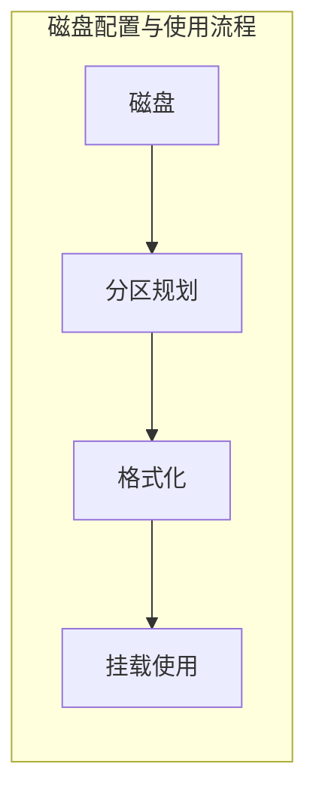
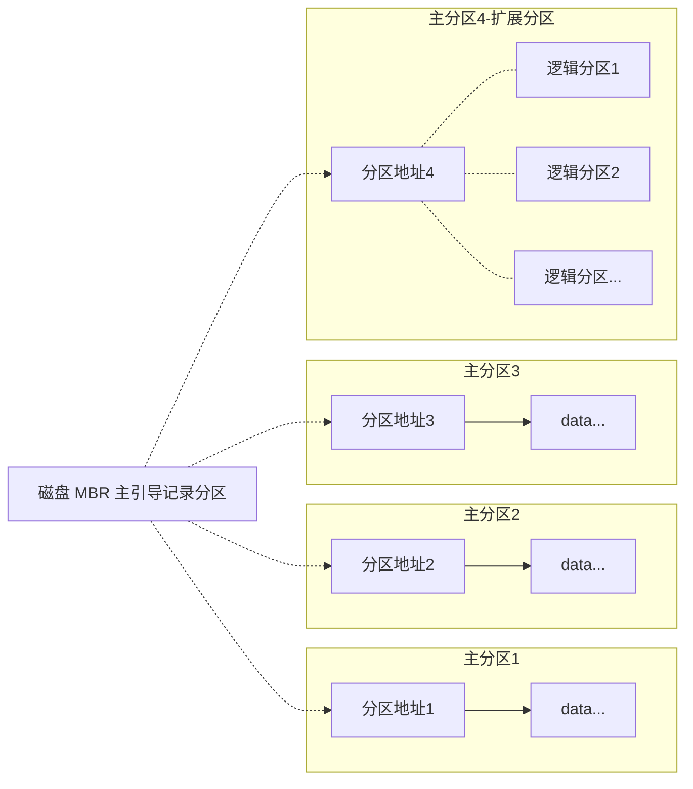

# 碎片化的RHEL8知识4

## `autofs`自动挂载

`autofs`意为 `Automount NFS`(自动挂载网络文件)，在man手册中的描述是 `Service control for the automounter`(自动安装挂载的控制服务)。用 `autofs`工具可以实现：使用时自动挂载来源网络共享的目录，闲置时自动卸载。

### 1#装包

```bash
[root@server0 ~]# yum -y install autofs
```

### 2#修改配置文件

```bash
# 编辑主配置文件 
[root@server0 ~]# vim /etc/auto.master
# 在最下方空一行并添加
# 说明:当用户访问/home/rhel8时自动挂载，挂载规则为/etc/auto.rule
/home/rhel8 /etc/auto.rule
```

```bash
# 创建并编辑规则文件
[root@server0 ~]# vim /etc/auto.rule
# 添加下面这行
# 说明:当有用户访问user1时，从网络位置172.25.0.254:/rhel8/user1中挂载目录，权限设为读写
user1  -rw   172.25.0.254:/rhel8/user1
```

### 3#启动配置

```bash
# RHEL8 新特性：设置开机自启动并启动服务
[root@server0 ~]# systemctl enable --now autofs
# 旧版命令
[root@server0 ~]# systemctl restart autofs
[root@server0 ~]# systemctl enable autofs
```

### 4#验证

```bash
[root@server0 ~]# su - user1
# 切换到用户 user1如果没有提示，并显示用户名已切换
[user1@server0 ~]$
# 就说明登录成功了(*ﾟ∇ﾟ)
```

## vim编辑器高级技巧

有空再填坑吧，咕了

## 单用户模式修改密码

### 1#进入内核选择界面

在内核选择界面按 `e`进入单用户模式


接下来就可以看到下面这个界面


### 2#进入单用户模式

将光标移动到 linux的位置，并跳转到最后


输入 `rd.break console=tty0`，再按 `Ctrl + X`


### 3#挂载根目录

看到下面这个画面就说明已经进入了紧急救援模式


接下来需要将系统的真实根目录以读写的权限挂载到当前紧急救援模式的 `/sysroot`目录中

接下来输入 `mount -o remount,rw / /sysroot`，这个命令表示重新挂载根目录


### 4#切换至根目录

输入 `chroot /sysroot/`切换目录到 `/sysroot/`


### 5#修改密码

接下来就可以进行密码的修改了

输入 `echo [new_password] | passwd --stdin root`，建议以非交互式的方式修改密码


### 6#加校验

为文件打上安全标签，输入 `touch /.autorelabel`，执行成功后输入 `exit`退出该目录


### 7#重启

输入 `reboot`重启，由于 Linux要校验文件，因此重启需要较长的时间


## `systemctl`系统管理服务

`systemctl`意为 `system control`(系统控制)，在man手册中描述为 `Control the systemd system and service manager`(控制系统的系统和服务管理器)，是一个用于管理各种服务的工具。

**语法：**`systemctl [参数] [服务名称]`

**常用参数：**

- `restart` 重启服务
- `start` 启动服务
- `enable` 设置开机启动服务
- `disable` 禁用开机启动服务
- `status` 查看服务状态(包含部分日志文件)

RHEL8 的新特性，设置开启启动并启动服务：`systemctl enable --now [服务名称]`

### `systemd`切换运行状态

**目标：**

- `graphical.target` 多用户模式，图形界面	
- `multi-user.target` 多用户模式，文本界面
- `rescue.target` 单用户模式
- `emergency.target` 紧急shell模式

**语法：**

- `systemctl isolate [目标]` 临时切换运行目标
- `systemctl get-default` 查看默认运行目标
- `systemctl set-default [目标]` 修改默认运行目标

## 文件系统



**格式化：**赋予空间文件系统的过程

**文件系统：**数据存储的规则

**常见的文件系统：**EXT2、EXT3、EXT4，RHEL7-8新增了 XFS

**关于常用的文件系统：**

- EXT4 第四代扩展文件系统，RHEL6系统默认
- XFS 高级日志文件系统，RHEL7系统默认
- SWAP 交换空间(虚拟内存)，利用硬盘空间缓解内存不足

### MBR分区

MBR全称 `Master boot record`(主引导记录区)，一种用于记录磁盘信息的磁盘分区。MBR分区中包含了磁盘分区表 DPT(Disk Partition Table)，DPT的大小为 64byte，有四个16 byte分区表，因此 MBR分区最多只能在磁盘上划分四个分区。

因此引入了逻辑分区这一概念，逻辑分区是在其中一个主分区上再做划分所得到的，主分区上会划分出逻辑分区的引导记录。

[MBR中文wiki](https://zh.wikipedia.org/wiki/%E4%B8%BB%E5%BC%95%E5%AF%BC%E8%AE%B0%E5%BD%95#MBR%E5%88%86%E5%8C%BA%E8%A1%A8%E4%B8%8EGPT%E5%88%86%E5%8C%BA%E8%A1%A8%E7%9A%84%E5%85%B3%E7%B3%BB)

[MBR和GPT知乎](https://zhuanlan.zhihu.com/p/26098509)




**注意：**

- 扩展分区不能用于格式化挂载，只能基于该分区创建逻辑分区
- MBR 分区方案最大只支持2.2TB的单块硬盘