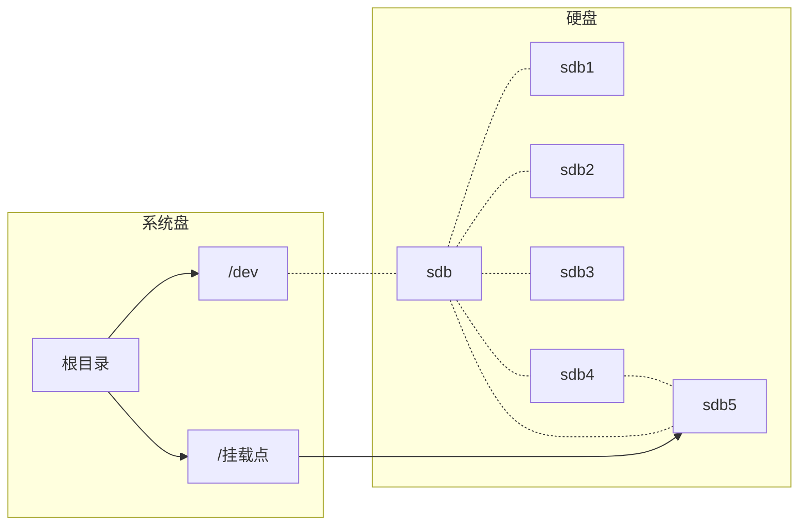
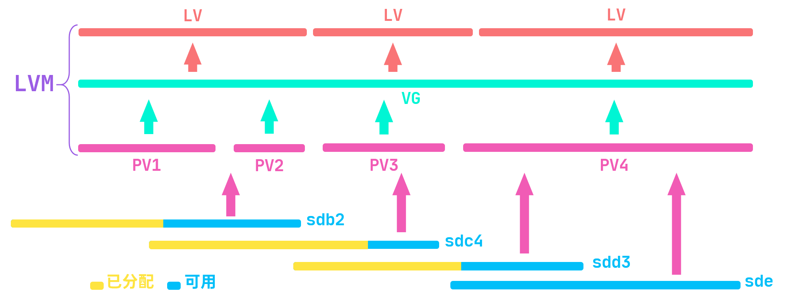

# 碎片化的RHEL8知识5

## 检测命令执行结果

输入命令`echo $?`可用于检测上一条命令的执行结果

- 返回值为0，说明**上一条**命令正常执行，输出提示信息
- 返回值非0，说明**上一条**命令执行失败，输出报错信息

## `fdisk`磁盘分区

在Linux中，识别硬盘是由系统自动识别，查看已经安装的硬盘使用的是 `lsblk`命令。`lsblk`命令意为 `list block devices`(块设备列表)，主要用于查看已安装的硬盘信息。

`fdisk`工具在man 手册中的描述是 `manipulate disk partition table`(用于操作磁盘分区表)，可以用该命令来创建分区，也可以查看分区信息。

### 查看磁盘分区情况

**语法：**`fdisk -l /dev/[磁盘名]`

### 创建磁盘主分区

#### 1#进入`fdisk`引导界面

**语法：**`fdisk /dev/[磁盘名]`

输入该命令后会进入一个交互式分区引导界面，按 `m`可以获取帮助，这里列出了一些常用命令

```bash
#常用命令
Generic
#   删除一个分区
d   delete a partition
# 	添加一个新分区
n   add a new partition
#   打印输出分区表
p   print the partition table
#杂项
Misc
#   打印输出命令菜单
m   print this menu
#保存与退出
Save & Exit
#   保存分区表至硬盘并退出
w   write table to disk and exit
#   退出不保存
q   quit without saving changes
```

#### 2#分区属性设置

接下来按 `n`并回车进行创建分区的操作，接下来会输出一段说明并让你选择分区类型

```bash
#分区类型
Partition type
  #p   主分区 (当前0个主分区,0个扩展分区,剩余4个分区可分配)
   p   primary (0 primary, 0 extended, 4 free)
  #e   扩展分区 (逻辑分区的容器)
   e   extended (container for logical partitions)
#选择 (默认为主分区)
Select (default p):
```

由于默认为创建主分区，因此直接回车确认即可，接下来是询问分区号，也是直接确认

```bash
# 分区号 (1-4, 默认为1)
Partition number (1-4, default 1): 
```

然后就是起始扇区的分配，这个是该分区的起始地址，直接确认即可

```bash
#起始扇区 (2048-41943039,默认2048) 
First sector (2048-41943039, default 2048):
```

#### 3#分区大小的分配

终点扇区分配，即这个分区的结束地址。默认会分配完剩余空间，因为计算困难，这里不建议直接填写数字。最好使用 `+200M`、`+1G`等形式修改容量

```bash
#终点扇区,+扇区 或 +大小{字节大小单位...} (2048-41943039，默认41943039)
Last sector, +sectors or +size{K,M,G,T,P} (2048-41943039, default 41943039):
```

确认后，会提示

```bash
#创建了类型为'Linux'且大小为1G的新分区1
Created a new partition 1 of type 'Linux' and of size 1 GiB.
```

然后就可以按 `p`打印出分区信息，查看分区情况了。

补充：如果版本是红帽7，在进行了一次磁盘分区后再次对磁盘进行分区，保存后会有报错，这时候就需要使用 `partprobe`刷新磁盘分区列表

### 创建扩展分区

如果我们已经创建了3个扩展分区，那么我们在 `fdisk`交互界面创建新的分区时可以看到，选择分区类型时默认选择扩展分区。

```bash
#分区类型
Partition type
  #p   主分区 (当前3个主分区,0个扩展分区,剩余1个分区可分配)
   p   primary (3 primary, 0 extended, 1 free)
  #e   扩展分区 (逻辑分区的容器)
   e   extended (container for logical partitions)
#选择 (默认为扩展分区)
Select (default e): 
```

回车确认后，还会顺带把分区号选为4，接下来就是起始扇区的选择了。像创建主分区一样，直接回车确认就行。

由于已经分配完了前3个分区，因此剩余的磁盘空间都是扩展分区的，所有直接回车，把剩余的空间都分配给扩展分区。

```bash
#起始扇区，直接确认
First sector (12584960-41943039, default 12584960):  
#终点扇区，直接确认
Last sector, +sectors or +size{K,M,G,T,P} (12584960-41943039, default 41943039): 
```

**注意：**在 `fdisk`工具中查看扩展分区时显示的是其实际大小，但是在终端中使用 `lsblk`命令查看时，将不会显示扩展分区的实际大小

### 创建逻辑分区

当我们创建了3个主分区和1个扩展分区后，在 `fdisk`中创建新的分区时会提示

```bash
# 所有主分区都在使用中
All primary partitions are in use.
# 添加逻辑分区5
Adding logical partition 5
#起始扇区 (12587008-41943039, 默认 12587008)
First sector (12587008-41943039, default 12587008): 
```

逻辑分区起始地址的计算：

`扩展分区首地址 - 2048`& `前一逻辑分区结束地址 - 2048`

然后就是终点地址分配，与之前的操作相同

```bash
#终点扇区,+扇区 或 +大小{字节大小单位...} (12587008-41943039，默认41943039)
Last sector, +sectors or +size{K,M,G,T,P} (12587008-41943039, default 41943039): 
```

### 检查、保存与退出

输入 `p`回车会打印输出分区表，如果想要删除一个分区，可以输入 `d`进行删除

```bash
Command (m for help): d
#要删除的分区号 (1-5,默认5)
Partition number (1-5, default 5): 
```

没问题了，就输入 `w`并回车将会保存并退出，并输出一段提示

```bash
#f分区列表已经发生了改变
The partition table has been altered.
# 调用iotcl()重新读取分区表
Calling ioctl() to re-read partition table.
#同步磁盘
Syncing disks.
```

然后使用 `lsblk`命令就可以看到之前修改的分区了

```bash
[root@server0 ~]# lsblk
NAME          MAJ:MIN RM  SIZE RO TYPE MOUNTPOINT
sda             8:0    0   20G  0 disk 
├─sda1          8:1    0    1G  0 part /boot
└─sda2          8:2    0   19G  0 part 
  ├─rhel-root 253:0    0   17G  0 lvm  /
  └─rhel-swap 253:1    0    2G  0 lvm  [SWAP]
sdb             8:16   0   20G  0 disk 
├─sdb1          8:17   0    1G  0 part 
├─sdb2          8:18   0    2G  0 part 
├─sdb3          8:19   0    3G  0 part 
├─sdb4          8:20   0    1K  0 part 
└─sdb5          8:21   0    1G  0 part 
sr0            11:0    1  6.6G  0 rom  /dvd
```

**设备及分区命名规则**：

**sdb3:**第二块SAS(SCSI)或SATA接口磁盘的第三个分区

- `s` SAS(SCSI)或SATA接口的磁盘
- `d` disk(磁盘)
- `b` 第二块磁盘(按照英文字母表排序)
- `3`第三个分区

## `mkfs`格式化分区

`mkfs`命令意为 `make file system`(创建文件系统)，在man 手册中的描述是 `build a Linux filesystem`(创建一个Linux文件系统)，该命令主要用于对磁盘分区格式化。

```bash
# 输入mkfs.加两次Tab就会列出系统支持的全部文件系统
[root@server0 ~]# mkfs.
mkfs.cramfs  mkfs.ext3    mkfs.fat     mkfs.msdos   mkfs.xfs
mkfs.ext2    mkfs.ext4    mkfs.minix   mkfs.vfat
```

**语法：**`mkfs.[文件系统] /dev/[分区]`

格式化分区 sdb1

```bash
[root@server0 ~]# mkfs.xfs /dev/sdb1
```

格式化后，可以使用 `blkid`命令查看分区信息，可以看到类型为 `xfs`格式

```bash
[root@server0 ~]# blkid /dev/sdb1
/dev/sdb1: UUID="45deffc5-7ae0-44e5-9278-1c32681017d7" TYPE="xfs" PARTUUID="6a3792fd-01"
```

## `mount`挂载使用

### 1#创建挂载点

在Linux中的磁盘分区是不能直接访问的，需要创建一个挂载点才能够访问，相当于是创建了一个文件夹，这个文件夹存储的是磁盘分区的地址，访问该文件夹就能够访问到该磁盘

**语法：**`mount /dev/[分区] /挂载路径`

在下图中，虚线表示仅读取相关信息，实线箭头表示可以访问



下面是创建一个挂载点并挂载分区的命令，注意挂载的分区要先格式化

```bash
[root@server0 ~]# mkdir /mount_sdb1
# 这个只能临时挂载，重启失效
[root@server0 ~]# mount /dev/sdb1 /mount_sdb1/
```

挂载完成后可以使用 `df -Th`命令查看挂载是否成功

```bash
[root@server0 ~]# df -Th
Filesystem            Type      Size  Used Avail Use% Mounted on
devtmpfs              devtmpfs  969M     0  969M   0% /dev
tmpfs                 tmpfs     984M     0  984M   0% /dev/shm
tmpfs                 tmpfs     984M  9.4M  974M   1% /run
tmpfs                 tmpfs     984M     0  984M   0% /sys/fs/cgroup
/dev/mapper/rhel-root xfs        17G  3.9G   14G  23% /
/dev/sr0              iso9660   6.7G  6.7G     0 100% /dvd
/dev/sda1             xfs      1014M  153M  862M  15% /boot
tmpfs                 tmpfs     197M   16K  197M   1% /run/user/42
tmpfs                 tmpfs     197M  4.0K  197M   1% /run/user/0
/dev/sdb1             xfs      1014M   40M  975M   4% /mount_sdb1
```

`df`意为 `disk free`(磁盘可用)，在man 手册中的描述是 `report file system disk space usage`(报告文件系统磁盘空间使用情况)

**选项：**

- `-T` 显示文件系统
- `-h` 以人类可读的形式显示容量 

如果想要卸载设备，就应该使用 `umount`命令去卸载挂载点

**语法：**`umount /挂载点路径 或 /设备路径`

```bash
[root@server0 ~]# umount /mount_sdb1
```

## `fstab`自动挂载

由于使用 `mount`命令只能临时挂载设备，因此需要在 `/etc/fstab`文件中进行配置哪些设备需要在开机的过程中挂载。修改的时候请注意，写错了会导致开机失败，需要进入单用户模式进行修改。

```bash
[root@server0 ~]# vim /etc/fstab
#设备/分区					挂载点				  文件系统	挂载参数默认	备份标记 检测顺序
/dev/sdb1               /mount_sdb1             xfs     defaults        0 0
```

如果在 `/etc/fstab`中的设备有未挂载的，可以使用 `mount -a`命令进行挂载

> 在man手册中，`-a` 的功能是 
> `Mount all filesystems (of the given types)  mentioned in  fstab`
> 挂载fstab中提到的所有文件系统(给定类型)

## 交换分区

也称为交换空间，相当于是虚拟内存，利用磁盘空间来模拟内存，用于缓解物理内存上的不足的问题

将分区格式化成 `swap`(交换)分区，使用的是 `mkswap`命令

```bash
[root@server0 ~]# mkswap /dev/sdb6
# 创建成功后的提示信息
Setting up swapspace version 1, size = 512 MiB (536866816 bytes)
no label, UUID=c84c4fd0-b34a-4324-af34-875560b136b2
```

当然也可以使用 `blkid`查看信息

```bash
[root@server0 ~]# blkid /dev/sdb6
/dev/sdb6: UUID="c84c4fd0-b34a-4324-af34-875560b136b2" TYPE="swap" PARTUUID="6a3792fd-06"
```

格式化完成以后就是启用，命令是 `swapon`

```bash
[root@server0 ~]# swapon /dev/sdb6
# 查看交换分区信息
[root@server0 ~]# swapon -s
Filename                                Type            Size    Used    Priority
/dev/dm-1                               partition       2097148 0       -2
/dev/sdb6                               partition       524284  0       -3
```

`swapoff`命令可以停止使用一个交换分区

```bash
[root@server0 ~]# swapoff /dev/sdb6
```

如果想要开机自动挂载一个交换分区，还需编辑 `/etc/fstab`文件，在最下方添加

```bash
#设备					  挂载点					文件类型  默认挂载   备份标记 检测优先级
/dev/sdb6               swap                    swap    defaults        0 0
```

如果 `fstab`中有 `swap`设备没有挂载，输入 `swapon -a`命令即可马上挂载

## LVM分区

LVM 即 ` Logical Volume Manager`(逻辑卷管理)，是 Linux的一种磁盘管理机制，LVM 是建立在磁盘和分区之上的一个逻辑层，用于提高磁盘分区管理的灵活性。

LVM：将众多的物理卷PV组成卷组VG，再将卷组中划分逻辑卷LV

LVM 分区就是建立在逻辑卷之上的一种磁盘分区，它的优点如下：

- 整合分散的空间
- 可以后期扩容



### LVM管理工具集

|     功能      | 物理卷管理  |  卷组管理   | 逻辑卷管理  |
| :-----------: | :---------: | :---------: | :---------: |
|  `scan`扫描   |    `pvs`    |    `vgs`    |    `lvs`    |
| `create`创建  | `pvcreate`  | `vgcreate`  | `lvcreate`  |
| `display`显示 | `pvdisplay` | `vgdisplay` | `lvdisplay` |
| `remove`删除  | `pvremove`  | `vgremove`  | `lvremove`  |
| `extend`扩展  |    NULL     | `vgextend`  | `lvextend`  |

### 1#创建卷组VG

由于创建VG的过程中会自动把分区创建为物理卷，因此直接用 `vgcreate`创建卷组即可

**语法：**`vgcreate [卷组名] [设备名1] [设备名2] [设备名..] `

```bash
[root@server0 ~]# vgcreate vg1 /dev/sdb2 /dev/sdb3
# 物理卷"/dev/sdb2"创建成功
  Physical volume "/dev/sdb2" successfully created.
# 物理卷"/dev/sdb2"创建成功
  Physical volume "/dev/sdb3" successfully created.
# 卷组"vg1"创建成功
  Volume group "vg1" successfully created
```

### 2#创建逻辑卷

有了卷组，就能基于卷组去创建逻辑卷了

**语法：**`lvcreate -L [逻辑卷大小] -n [逻辑卷名] [卷组名]`

```bash
[root@server0 ~]# lvcreate -L 114M -n lv1_vg1 vg1
# 将大小取整为完整的物理范围116 MiB
  Rounding up size to full physical extent 116.00 MiB
# 逻辑卷"lv1_vg1"创建
  Logical volume "lv1_vg1" created.
```

创建完成后可以使用两条命令查看到新建的逻辑卷，都是自动生成的软链接指向创建的逻辑卷

- `ls /dev/mapper/[卷组名-逻辑卷名]`
- `ls /dev/[卷组名]/[逻辑卷名]`

### 3#挂载逻辑卷

逻辑卷也就是逻辑分区，使用也和物理分区一样，需要格式化并挂载才能使用

```bash
[root@server0 ~]# mkfs.xfs /dev/vg1/lv1_vg1 
```

创建挂载点 `/lv1`，然后修改 `/etc/fstab`中的配置，让开机其自动挂载

```bash
# 创建挂载点
[root@server0 ~]# mkdir /lv1
# 修改自动挂载配置文件
[root@server0 ~]# vim /etc/fstab
# 添加下面这行
/dev/vg1/lv1_vg1        /lv1                    xfs     defaults        0 0
# 让其自动挂载
[root@server0 ~]# mount -a
# 查看已挂载设备，可以看到该设备已经挂载在了 /lv1上
[root@server0 ~]# df -Th
Filesystem              Type      Size  Used Avail Use% Mounted on
devtmpfs                devtmpfs  969M     0  969M   0% /dev
tmpfs                   tmpfs     984M     0  984M   0% /dev/shm
tmpfs                   tmpfs     984M  9.4M  974M   1% /run
tmpfs                   tmpfs     984M     0  984M   0% /sys/fs/cgroup
/dev/mapper/rhel-root   xfs        17G  3.9G   14G  23% /
/dev/sr0                iso9660   6.7G  6.7G     0 100% /dvd
/dev/sdb1               xfs      1014M   40M  975M   4% /mount_sdb1
/dev/sda1               xfs      1014M  153M  862M  15% /boot
tmpfs                   tmpfs     197M   16K  197M   1% /run/user/42
tmpfs                   tmpfs     197M  4.0K  197M   1% /run/user/0
/dev/mapper/vg1-lv1_vg1 xfs       111M  6.9M  104M   7% /lv1
```

### 5#扩充卷组

如果需要扩充逻辑卷，但卷组空间不足，就需要用PV 扩充卷组，命令是 `vgextend`

**语法：**`vgextend [卷组名] [物理卷路径1] [物理卷路径2] [物理卷路径..] `

```bash
[root@server0 ~]# vgextend vg1 /dev/sdb5
# 物理卷"/dev/sdb5"创建成功
  Physical volume "/dev/sdb5" successfully created.
# 卷组"vg1"扩展成功
  Volume group "vg1" successfully extended
```

### 6#扩充逻辑卷

逻辑卷的优点是能够非常随便的扩展，使用的是`lvextend -L`命令

**语法：**`lvextend -L +[扩容的大小] [逻辑卷路径]`

```bash
[root@server0 ~]# lvextend -L +514M /dev/vg1/lv1_vg1 
# 根据PE取整到了合适的范围内：516.00 MiB。
  Rounding size to boundary between physical extents: 516.00 MiB.
  #逻辑卷vg1/lv1_vg1的大小从116.00 MiB（29个扩展区）更改为632.00 MiB
  Size of logical volume vg1/lv1_vg1 changed from 116.00 MiB (29 extents) to 632.00 MiB (158 extents).
# 逻辑卷vg1/lv1_vg1已成功调整大小
  Logical volume vg1/lv1_vg1 successfully resized.
```

但是扩展以后，使用 `df -Th`查看已挂载设备，会发现逻辑卷的大小并没有发生变化，这是因为文件系统并没有更新。

#### 刷新`xfs`文件系统

**语法：**`xfs_growfs [挂载点路径]`

```bash
[root@server0 ~]# xfs_growfs /lv1/
```

#### 刷新`ext`文件系统

**语法：**`resize2fs [设备路径]`

### 7#卷组划分的最小单位

`PE`全称 `physical extent`(物理区域)，是物理卷中可用于分配的最小存储单元，大小默认为 4M，创建的逻辑卷大小如果不是PE大小的整数倍，就会进行进行扩展至整数倍，比如创建一个 11M的逻辑卷，因为11不是4的倍数，向上取整，使创建的逻辑卷大小变为 12M。

#### 设置卷组的PE大小

**PE的大小要求：**

- 必须是2的次幂(2^0^、2^1^、2^2^、2^3^、2^4^)
- 如果已经基于这个卷组创建了逻辑卷，那么新设置的PE大小必须能被逻辑卷的大小整除
- 新设置的PE大小必须要能被卷组剩余空间的大小整除

使用 `vgdisplay`可以看到卷组的信息以及PE的大小

#### 1#修改卷组的PE大小

**语法：**`vgchange -s [PE大小] [卷组名]`

```bash
[root@server0 ~]# vgchange -s 2M vg1 
# 卷组"vg1"成功修改
  Volume group "vg1" successfully changed
# 查看卷组
[root@server0 ~]# vgdisplay vg1
  --- Volume group ---
  VG Name               vg1
  System ID             
  Format                lvm2
  Metadata Areas        3
  Metadata Sequence No  5
  VG Access             read/write
  VG Status             resizable
  MAX LV                0
  Cur LV                1
  Open LV               1
  Max PV                0
  Cur PV                3
  Act PV                3
  VG Size               <5.99 GiB
  PE Size               2.00 MiB
  Total PE              3066
  Alloc PE / Size       316 / 632.00 MiB
  Free  PE / Size       2750 / 5.37 GiB
  VG UUID               Zbz2BI-tJFf-fL9M-sQuV-M2OK-jeyr-ZREU
```

#### 2#创建卷组时指定PE

**语法：**`vgcreate -s [PE大小] [卷组名] [设备路径1] [设备路径...]`

#### 3#用PE创建和扩充逻辑卷

也可以使用 PE来指定逻辑卷的大小，具体命令如下

**扩展逻辑卷语法：**`lvextend -l [扩展的PE数量] [逻辑卷路径]`

**创建逻辑卷语法：**`lvcreate -l [PE的数量] -n [逻辑卷名] [卷组名]`

```bash
[root@server0 ~]# lvextend -l 700 /dev/vg1/lv1_vg1
# 逻辑卷vg1/lv1_vg1的大小从632.00 MiB（316扩展区）更改为<1.37 GiB(700扩展区)
  Size of logical volume vg1/lv1_vg1 changed from 632.00 MiB (316 extents) to <1.37 GiB (700 extents).
# 逻辑卷vg1/lv1_vg1成功调整大小
  Logical volume vg1/lv1_vg1 successfully resized.
```

### 删除逻辑卷

删除逻辑卷需要依次：卸载挂载点->删除逻辑卷->删除卷组->删除物理卷

**具体命令如下：**

1. `umount [挂载点]`
2. `lvremove /dev/卷组名称/逻辑卷名称`
3. `vgremove 卷组名称`
4. `pvremove /dev/物理卷名称`

> **关于缩小逻辑卷的大小**
>
> 由于缩小逻辑卷的同时也要缩小文件系统，这会导致数据出错，因此无意义
>
> ext4文件系统支持缩小
>
> xfs文件系统不支持缩小

## `stratis`高级存储功能

Stratis 是一个卷管理文件系统volume-managing filesystem(VMF)，类似于 [ZFS](https://en.wikipedia.org/wiki/ZFS) 和 [Btrfs](https://en.wikipedia.org/wiki/Btrfs)。它使用了存储“池”的核心思想，该思想被各种 VMF 和 形如 [LVM](https://en.wikipedia.org/wiki/Logical_Volume_Manager_(Linux)) 的独立卷管理器采用。

通过Stratis，便捷的使用精简配置(thin provisioning)、快照(snapshots)和基于池(pool-based)的管理和监控等高级存储功能。

### 1#装包启动

```bash
[root@server0 ~]# yum -y install stratis-cli stratisd
```

其中 `stratisd`是守护进程，而 `stratis-cli`是命令行管理器

```bash
[root@localhost ~]# systemctl enable --now stratisd
```

设置开机自启并启动服务

### 2#创建存储池

**语法：**`stratis pool create [存储池名] [块设备路径...]`

```bash
[root@localhost ~]# stratis pool create pool1 /dev/sdb
```

查看设备使用的是 `stratis pool list`命令，该命令打印结果如下

```bash
#池名		总物理大小			总物理物理使用大小
Name     Total Physical Size  Total Physical Used
pool1                 20 GiB               52 MiB
```

### 3#存储池设备管理

**添加块设备语法：**`stratis pool add-data [存储池名] [块设备路径...]`

```bash
[root@localhost ~]# stratis pool add-data pool1 /dev/sdc
```

查看存储池中的块设备使用 `stratis blockdev list`，可以在 `list`后指定存储池名，打印结果如下

```bash
#存储池名	设备名				物理大小		状态	层级
Pool Name  Device Node    Physical Size   State  Tier
pool1      /dev/sdb              20 GiB  In-use  Data
pool1      /dev/sdc              20 GiB  In-use  Data
```

### 4#创建文件系统

**语法为：**`stratis filesystem create [存储池名] [文件系统名]`

```bash
[root@localhost ~]# stratis filesystem create pool1 fs1
```

查看文件系统 `stratis filesystem list`，打印结果如下

```bash
#存储池名|文件系统名|已使用大小|创建时间			设备路径			  标识
Pool Name  Name  Used     Created            Device              UUID
pool1      fs1   546 MiB  Dec 20 2020 01:13  /stratis/pool1/fs1  a4db0fa6e32248aa90e3f2df1af73919
```

可以使用 `blkid`查看文件系统类型，可以看到文件系统为 `xfs`类型

```bash
[root@localhost ~]# blkid /stratis/pool1/fs1
/stratis/pool1/fs1: UUID="a4db0fa6-e322-48aa-90e3-f2df1af73919" TYPE="xfs"
```

### 5#挂载使用

就可其他的物理分区和LVM分区一样，创建挂载点，挂载使用即可，自动挂载需要编辑 `/etc/fstab`

```bash
/stratis/pool1/fs1   /part3   xfs   defaults,x-systemd.requires=stratisd.service   0 0
```

建议使用 `UUID`进行挂载，此外需要声明该分区要在系统启动了 `stratisd`服务后挂载

### 6#创建快照

**语法：**`stratis filesystem snapshot [存储池名] [文件系统名] [快照名]`

```bash
[root@localhost ~]# stratis filesystem snapshot pool1 fs1 snap1
```

使用 `stratis filesystem list`可以看到创建的快照，打印结果如下

```bash
Pool Name  Name   Used     Created            Device                UUID
pool1      fs1    546 MiB  Dec 20 2020 01:13  /stratis/pool1/fs1    a4db0fa6e32248aa90e3f2df1af73919  
pool1      snap1  546 MiB  Dec 20 2020 01:42  /stratis/pool1/snap1  27ccc7c8c99e48fe8bd2304671642e77
```

使用方法与文件系统相同，直接挂载使用即可恢复快照状态的数据