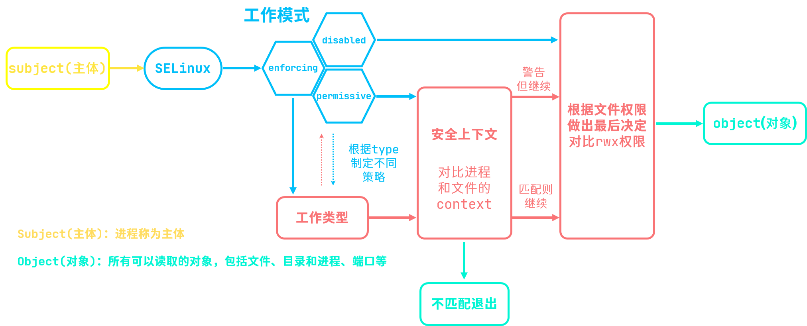

# 碎片化的RHEL8知识6

## VDO卷

`VDO`全称`Virtual Data Optimize`(虚拟数据优化)是RHEL8/Centos8上新推出的一个存储相关技术，主要用于压缩存储设备上的数据并进行重复删除，以此来优化存储空间的使用。

**模块介绍：**

- `kvdo`：用于控制数据压缩
- `uds`：用于重复数据删除

### 1#安装

一般来说都是默认安装的，除非是最小系统

```bash
[root@server0 ~]# yum -y install vdo kmod-kvdo
```

### 2#创建VDO卷

**语法：**`vdo create -n [卷名] --device [设备路径] --vdoLogicalSize [逻辑大小]`

```bash
[root@server0 ~]# vdo create -n vdo1 --device /dev/sdc --vdoLogicalSize 50G
# 创建VDO卷vdo1
Creating VDO vdo1
#启动VDO卷vdo1
Starting VDO vdo1
#在VDO卷vdo1上开始压缩
Starting compression on VDO vdo1
#VDO卷实例0已经在/dev/mapper/中准备好
VDO instance 0 volume is ready at /dev/mapper/vdo1
```

### 3#查看状态

查看全部VDO卷，语法：`vdo list`，该命令会列出全部VDO卷的卷名

想要查看VDO卷单卷状态需要使用 `status`参数

**语法：**`vdo status -n [卷名]`

```bash
#查看是否启用删除重复项
[root@server0 ~]# vdo status -n vdo1|grep Dedu
#	重复数据删除：已启用
    Deduplication: enabled
#查看是否启用数据压缩
[root@server0 ~]# vdo status -n vdo1|grep Com
#	压缩：已启用
    Compression: enabled
```

### 4#停止与启动

**停止VDO卷：**`vdo stop -n [卷名]`

**启动VDO卷：**`vdo start -n [卷名]`

### 5#格式化VDO卷

参考之前的 `mkfs`命令[click me](./碎片化的RHEL8知识5.md)

```bash
[root@server0 ~]# mkfs.xfs -K /dev/mapper/vdo1 
```

`-K` 不马上丢弃空数据块，加快格式化速度

虽然上面这条命令能够快速格式化，但还需要再次检查格式化是否已经彻底完成

命令为 `udevadm settle`，如果没有输出则说明格式化已经完成了

### 6#挂载使用

创建了挂载点以后，建议使用 UUID进行挂载

```bash
[root@server0 ~]# blkid /dev/mapper/vdo1 
/dev/mapper/vdo1: UUID="c2a47516-709f-4332-8582-bb6067a5debb" TYPE="xfs"
[root@server0 ~]# vim /etc/fstab
# 在文件最下方添加，建议使用UUID进行挂载
UUID=c2a47516-709f-4332-8582-bb6067a5debb /part4 xfs defaults,x-systemd.requires=vdo.service 0 0
# 直接挂载在挂载点上
[root@server0 ~]# mount /part4/
```

挂载完成后直接使用 `df -Th`命令看到的是VDO卷的逻辑大小

实际使用大小需要使用命令 `vdostats --human-readable`以人类易读形式查看

## 防火墙

RHEL的防火墙体系：

- 系统服务：`firewalld`
- 管理工具：
  - `firewall-cmd`(命令行)
  - `firewall-config`(图形界面)

### 预设安全区域

根据所在的网络场所区分,预设保护规则集，下面是主要用到的四个区域

| 区域名               | 功能                                                   |
| -------------------- | ------------------------------------------------------ |
| `public`(公共，默认) | 仅允许访问本机的ssh、DHCP、cockpit这两个服务及ping本机 |
| `trusted`(信任)      | 允许任何访问                                           |
| `block`(屏蔽)        | 阻塞任何来访请求,明确拒绝                              |
| `drop`(丢弃)         | 丢弃任何来访的数据包,直接丢弃                          |

匹配原则：先查看预设区域中是否包含关于来源IP地址的规则，如果无匹配，则自动分配到默认区域

### 查看与修改防火墙

`firewall-cmd`意为 `firewalld command`(防火墙命令)，用于RHEL8中的防火墙的管理与配置。

#### 查看防火墙默认区域

**语法：**`firewall-cmd --get-default-zone`

```bash
# get-default-zone：获取默认区域
[root@server0 ~]# firewall-cmd --get-default-zone 
# 当前默认区域为公共区域
public
```

#### 修改防火墙默认区域

**语法：**`firewall-cmd --set-default-zone=[区域名]`

```bash
# set-default-zone：设置默认区域，敲两下Tab可以看到全部可选区域
[root@server0 ~]# firewall-cmd --set-default-zone=
block     drop      home      libvirt   trusted   
dmz       external  internal  public    work
# 将默认区域修改为信任
[root@server0 ~]# firewall-cmd --set-default-zone=trusted 
# 设置成功
success
```

#### 为区域添加一个可访问的服务(临时)

**语法：**`firewall-cmd --zone=[区域名] --add-service=[服务名]`

#### 查看区域属性信息

**语法：**`firewall-cmd --zone=[区域名] --list-all `

#### 重启防火墙

**语法：**`firewall-cmd --reload`

#### 永久配置防火墙策略

**语法：**`firewall-cmd --permanent [防火墙策略]`

#### 永久添加IP地址/网段到预设区域

**封禁网段语法：**

以下配置重启服务生效

`firewall-cmd --permanent --zone=[区域名] --add-source=[网段]/[子网掩码]`

`firewall-cmd --permanent --zone=[区域名] --add-source=[IP地址]`

#### 端口转发

**语法：**

`firewall-cmd --permanent --zone=trusted --add-forward-port=port=[源端口]:proto=[协议]:toport=[目的端口]`

常见端口号及其服务

| 端口 | 服务                        |
| ---- | --------------------------- |
| 21   | `ftp`文件传输协议           |
| 22   | `ssh`远程连接               |
| 25   | `smtp`邮件发送协议          |
| 53   | `dns`域名解析协议           |
| 69   | `tftp`简单文件传输协议      |
| 80   | `http`超文本传输协议        |
| 110  | `pop3`邮件接收协议          |
| 443  | `https`安全的超文本传输协议 |

## SELinux

SELinux安全机制：一套增强 Linux系统安全的强制访问控制体系，在系统内部控制本地的访问



**SELinux的运行模式：**

- `enforcing`强制模式：强制执行SELinux策略
- `permissive`宽松模式：不强制执行执行SELinux策略，仅发出警告
- `disabled`禁用模式：不执行任何策略，禁用SELinux功能

**查看SELinux模式：**`getenforce`

### 切换运行模式

#### 1#用命令行临时修改

**语法：**`setenforce [状态码]`

状态码：

- `1` : `enforcing` 强制
- `0` : `permissive` 宽松

#### 2#修改配置文件

路径为:`/etc/sysconfig/selinux`，注释中包含可选选项，该配置重启生效

```bash
#     enforcing - SELinux security policy is enforced.
#     permissive - SELinux prints warnings instead of enforcing.
#     disabled - No SELinux policy is loaded.
SELINUX=enforcing
```

### 服务架设——SMB

Samba服务，可跨平台共享文件夹，协议：SMB(TCP端口 `139`)验证，CIFS(TCP端口 `445`)传输数据

#### 准备

服务端：`server0.example.com` IP ：`172.25.0.11`

客户端：`classroom.example.com` IP : `172.25.0.254`

需要设置防火墙为 `trusted`(允许所有访问)

命令为：`firewall-cmd --set-default-zone=trusted`

#### 服务端配置

##### 1# 装包

```bash
[root@server0 ~]# yum -y install samba
```

##### 2# 创建samba 账号

建立samba共享账号使用 `pdbedit`命令，各个参数如下

- `pdbedit -a [用户名]` 添加用户为 samba共享账号
- `pdbedit -x [用户名]` 删除 samba共享账号
- `pdbedit -L` 列出所有的 samba共享账号

```bash
# 创建一个账户，但是禁止使用终端登录
[root@server0 ~]# useradd -s /sbin/nologin zhangsan
# 使用pdbedit -a命令添加已有Linux账户，会要求设置密码
[root@server0 ~]# pdbedit -a zhangsan
new password:
retype new password:
# 建议使用下面这个命令验证上一条语句的执行是否成功
[root@server0 ~]# echo $?
```

##### 3# 创建共享目录

```bash
[root@server0 ~]# mkdir /smbshare
# 设置用户权限
[root@server0 ~]# setfacl -R -m u:zhangsan:rwx /smbshare/
```

##### 4# 修改配置文件

**配置文件路径：**`/etc/samba/smb.conf`

```bash
# 在文件最下方添加三行配置
# 共享名
[zhyx]
		# 享目录的路径
        path = /smbshare
		# 以对其进行操作的用户列表
        write list = zhangsan
```

##### 5# 启动服务并设置开机自启

```bash
[root@server0 ~]# systemctl enable --now smb.service
```

##### 6# 修改Boolean值

查看与 samba服务相关的 Boolean值

```bash
[root@server0 ~]# getsebool -a|grep samba
```

修改 Boolean值

```bash
[root@server0 ~]# setsebool -P samba_export_all_rw on
```

#### 客户端配置

##### 1# 设置开机自动挂载samba

**配置文件路径：**`/etc/fstab`

```bash
//172.25.0.11/zhyx /smb cifs defaults,_netdev,user=zhangsan,pass=123 0 0
# //服务端IP/samba共享名称 /挂载点 cifs(samba文件系统)
# _netdev：这是一个网络设备
# user:samba账号
# pass:samba密码
```

##### 2# 创建挂载点

```bash
[root@classroom ~]# mkdir /smb
```

##### 3# 装包挂载

```bash
[root@classroom ~]# yum -y install cifs-utils
```

安装完成后，挂载目录

```bash
[root@classroom ~]# mount -a
# 提示找不到合适的地址，需要配置SELinux
Unable to find suitable address.
```

### 服务架设——httpd

#### 1# 装包

```bash
[root@server0 ~]# yum -y install httpd
```

#### 2# 启动服务并设置开机自启

```bash
[root@server0 ~]# systemctl enable --now httpd
```

启动后，就可以在浏览器中看到测试页了


#### 3# 修改配置文件

**配置文件路径：**`/etc/httpd/conf/httpd.conf`

输入 `:set number`显示行号，输入 `45G`跳转到45行

```bash
# 默认为80端口，可以修改为其他的端口
Listen 80
# 修改为82端口
Listen 82
```

这时重启服务会报错

```bash
[root@server0 ~]# systemctl restart httpd
# 由于控制进程退出并显示错误代码，因此httpd.service的重启失败
Job for httpd.service failed because the control process exited with error code.
# 有关详细信息，请参见“systemctl状态httpd.service”和“journalctl -xe”
See "systemctl status httpd.service" and "journalctl -xe" for details.
```

因为httpd 服务无法侦听本地的 82端口，因为SELinux不允许 httpd访问该端口

查看允许访问http端口信息使用 `semanage`命令，`semanage`意为 `SELinux Manage`(SELinux管理)

**语法：**`semanage port -l|grep http`

- `port` 端口
- `-l` `list`列表信息

因此该命令意为 列出SELinux的端口列表信息，并过滤出带有 `http`相关的行

```bash
[root@server0 ~]# semanage port -l|grep http
http_cache_port_t              tcp      8080, 8118, 8123, 10001-10010
http_cache_port_t              udp      3130
# 该行展示了可以侦听的http端口
http_port_t                    tcp      80, 81, 443, 488, 8008, 8009, 8443, 9000
pegasus_http_port_t            tcp      5988
pegasus_https_port_t           tcp      5989
```

#### 4# 开放端口

**语法：**`semanage port -a -t http_port_t -p tcp [开放的端口]`

- `-a` ：`add` 添加
- `-t`：`type` 类型
- `-p`：`protocol` 协议

```bash
[root@server0 ~]# semanage port -a -t http_port_t -p tcp 82
```

添加了端口后，重启 httpd服务即可从其他端口访问 httpd页面了

### 服务架设——自定义网页

#### 1# 修改文件存放目录

创建一个新的存放目录

```bash
[root@server0 ~]# mkdir /webcon
```

**配置文件路径：**`/etc/httpd/conf/httpd.conf `

修改配置文件中页面的根目录路径，位于第122行

```bash
# 默认配置如下
DocumentRoot "/var/www/html"
# 修改为
DocumentRoot "/webcon"
```

以及用户允许访问的目录路径

```bash
# 仅允许访问 /var/www目录下的内容
<Directory "/var/www">
# 允许访问根目录下的内容
<Directory "/">
```

编写完成后，直接重启服务

```bash
[root@server0 ~]# systemctl restart httpd
```

#### 2# 编写页面文件

在 `/webcon`中编写一个页面文件

```bash
[root@server0 ~]# vim /webcon/index.html
# 写入下面的文本
Hello World!
```

但是用浏览器访问IP地址，显示的还是原先的测试页面

这是因为 `/webcon`目录中的SELinux安全上下文标签不是可以用于作为网页文件存放目录的标签

#### 3# 查看安全上下文

**语法：**`ls -Z [文件]`

- -`Z` 打印文件的安全上下文

如果要查看目录的安全上下文，请添加 `-d`参数

**安全上下文有5个参数组成：**`user:role:type:sensitivity:category`

1. `user`指示登录系统的用户类型
2. `role`定义文件、进程和用户的用途
3. `type`指定数据类型，规则中定义何种进程类型访问何种文件
4. `sensitivity`限制访问需要，分0-15级，默认使用s0
5. `category`对于特定的组织划分不分层的分类，一般没有该选项

```bash
[root@server0 ~]# ls -Zd /var/www/html/
# 系统用户:文件:httpd系统内容
system_u:object_r:httpd_sys_content_t:s0 /var/www/html/
[root@server0 ~]# ls -Zd /webcon/
# 无用户限制:文件:默认类型:
unconfined_u:object_r:default_t:s0 /webcon/
[root@server0 ~]# ls -Z /webcon/index.html 
# 无用户限制:文件:默认类型:
unconfined_u:object_r:default_t:s0 /webcon/index.html
```

#### 4# 修改上下文

`chcon`命令意为 `change security context`(修改安全上下文)，可以用该命令将文件的安全上下文复制到其他文件

**复制安全上下文语法：**`chcon -R --reference=[源文件] [修改的文件]`

`--reference`使用指定文件的安全上下文

```bash
[root@server0 ~]# chcon -R --reference=/var/www/html /webcon/
```

然后重启服务就可以看到自定义的页面了

```bash
[root@server0 ~]# curl localhost:82
Hello World!
```

